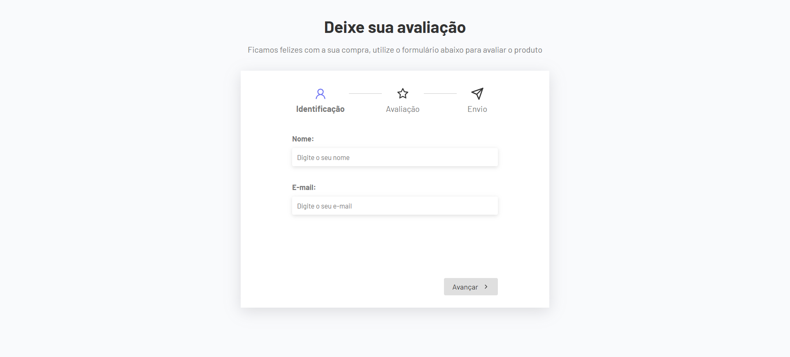

# 🧩 MultiStep Review

**MultiStep Review** é uma aplicação em **React** que implementa um formulário de múltiplas etapas (multi-step form), com etapas bem definidas para **cadastro, revisão e confirmação**. O projeto prioriza **experiência do usuário**, **componentização reutilizável** e **organização de código**, facilitando a manutenção e extensões futuras.

🔗 **Acesse a versão online:**  
👉 [https://multistepreview.netlify.app](https://multistepreview.netlify.app)

---

## 📸 Preview

---

## ✨ Funcionalidades

- ✅ **Formulário multi-etapas**: fluxo lógico e sequencial de preenchimento.
- 🔒 **Validação por etapa**: o usuário só avança após preencher corretamente.
- 👁️ **Resumo dos dados antes do envio**: confirmação final dos dados.
- 🙌 **Tela de agradecimento**: feedback visual ao finalizar o formulário.
- ♻️ **Componentização**: cada etapa é um componente reutilizável.
- ⚙️ **Hook customizado (`useForm`)**: gerencia estado e lógica de forma isolada.

---

## 🚀 Tecnologias utilizadas

- ⚛️ [React](https://react.dev/)
- ⚡ [Vite](https://vitejs.dev/)
- 🎨 CSS modular (por componente)
- 💡 JavaScript (ES6+)
- 🪝 React Hooks: `useState`, `useEffect`, e hook customizado `useForm`

---

## 🛠️ Como rodar o projeto localmente

git clone https://github.com/seuusuario/multistepreview.git

cd multistep-react

npm install

npm run dev

Depois, acesse http://localhost:5173 no navegador.

📄 Licença
Distribuído sob a licença MIT. Veja LICENSE para mais detalhes.
© Feliipevasconcellos

📬 Contato
Caso tenha dúvidas, sugestões ou queira colaborar:

Abra uma issue

Ou envie um PR com melhorias!

Este projeto foi desenvolvido com fins educacionais, com foco em boas práticas de front-end, acessibilidade e UX.
Fique à vontade para adaptar e expandir conforme suas necessidades! 🚀
